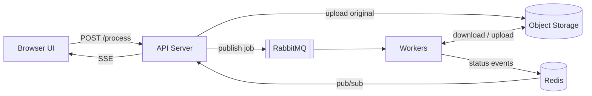

# Image Upscaler

Project to learn how to implement a task scheduler using RabbitMQ, including:

- Retry failed jobs
- Dead-letter queue for permanently failed jobs
- Idempotency, avoid duplicate processing
- Priority queue (paid users vs. free users?)
- Rate limiting on uploads
- Progress updates (queued, processing, completed)
- Automatic cleanup of temporary files

## Design

Browser gets a session cookie (random ID, temp username, no login yet).



| Component       | Responsibility                                                                   |
| --------------- | -------------------------------------------------------------------------------- |
| API server      | Uploads, sessions, rate limiting, SSE, publishing jobs                           |
| Object storage (MinIO / S3) | Original images and upscaled results                                             |
| RabbitMQ        | Work queues, retry with backoff, DLQ, priority                                   |
| Redis           | Job status store, pub/sub for SSE fan-out, idempotency keys, rate-limit counters |
| Workers         | Consume jobs, download → upscale (libvips/sharp) → upload result                 |

> [!NOTE]
> RabbitMQ handles retry, DLQ, and priority but not idempotency or rate limiting.
>
> RabbitMQ gives at-least-once delivery, which means duplicates are possible by design 
> (e.g. a worker dies after processing but before ack → message is redelivered).
> Deduplication and rate limiting are application concerns; Redis is here for that.

### API

| Endpoint         | Description                                  |
| ---------------- | -------------------------------------------- |
| `POST /process`  | multipart `image` + `scale` → `202 {job_id}` |
| `GET /jobs/{id}` | status + result URL (session-scoped)         |
| `GET /events`    | SSE stream of job events for this session    |

### Happy Path

`POST /process` (multipart: image + scale):

- Rate-limit check (token bucket in Redis, keyed by session/IP)
- Validate file type/size, upload original to object storage
- Create job record in Redis: `job:{id} = {status: queued, session, scale, key}`
- Publish message `{job_id, object_key, scale}` — **persistent delivery mode + publisher confirm** — then return `202 {job_id}`

Worker (manual ack, `prefetch=1` so long jobs are fairly dispatched):

- Idempotency check: `SET job:{id}:lock NX EX 600`. If it fails, another worker has/had it → ack and skip
- Set status `processing`, download, upscale, upload result to a **deterministic key** (`results/{job_id}.png`) so reprocessing overwrites instead of duplicating
- Set status `completed` + result URL, publish event to Redis pub/sub, **ack last**
- Result is served via a pre-signed URL, only to the session that created the job.

API server is subscribed to the pub/sub channel and pushes events over `GET /events` (SSE), filtered to the requesting session. On SSE reconnect/refresh, `GET /jobs/{id}` reads current state from Redis

### Queue Topology

```
exchange: upscale.work (direct)
├── queue: upscale.jobs.paid      ← more consumers
└── queue: upscale.jobs.free      ← fewer consumers

exchange: upscale.retry (direct)
└── queue: upscale.retry.30s      x-message-ttl: 30000
                                  x-dead-letter-exchange: upscale.work

queue: upscale.dlq                (parking lot, no TTL — inspected manually)
```

#### Priority: two queues instead of `x-max-priority`

A single priority queue is simpler to declare but risks starving free users under load, and priority support on quorum queues is limited. Two queues with weighted consumer counts (e.g. 3 paid / 1 free) guarantee free jobs always make progress. Routing key = user tier.

#### Retry: TTL + dead-letter shovel, not nack-requeue

`nack(requeue=true)` retries immediately and forever (hot loop, no backoff). Instead the worker does `nack(requeue=false)`; the queue's DLX routes the message to `upscale.retry.30s`, where it sits until TTL expires and gets dead-lettered _back_ to the work exchange.

The `x-death` header counts the round trips — when attempts ≥ 3, the worker publishes the message to `upscale.dlq` instead of nack-ing.

- For exponential backoff, add tiers (`retry.30s`, `retry.2m`, `retry.10m`), per-queue TTL must be fixed, because a message with a long TTL at the head of the queue would block expired messages behind it.
- **Distinguish failure types.** Retry only _transient_ errors (storage timeout, OOM). Permanent errors (corrupt image, unsupported format) go straight to the DLQ.

### Durability & Delivery Guarantees

- Durable exchanges/queues + persistent messages: jobs survive broker restart.
- Publisher confirms on the API side: `202` is only returned after the broker confirms.
- Manual ack **after** the result is uploaded, never on receipt — a worker crash mid-job means redelivery, and the idempotency lock + deterministic result key make redelivery safe.

### Progress Updates

Worker → Redis (`HSET job:{id} status …` + `PUBLISH job-events`) → API → SSE.

Why not push status through RabbitMQ? It works (fanout exchange, one auto-delete queue
per API instance), but Redis pub/sub is simpler and we already need Redis as the status
store — SSE consumers can drop messages harmlessly since `GET /jobs/{id}` always has
the authoritative state.

Status granularity: `queued → processing → completed | failed`, optionally with retry count (`queued (attempt 2/3)`).

### Cleanup

- Bucket lifecycle rule: everything under `uploads/` and `results/` expires after 24 h. this is the safety net that always runs, even if the app is down.
- Eager cleanup: worker deletes the original after the result is written; API deletes the result key from Redis with `EXPIRE job:{id} 86400` so job records vanish with files.

## RabbitMQ vs Kafka

RabbitMQ is a traditional message broker (smart router) with granular per-message control: ack, nack, requeue, dead-letter, TTL, priority. It pushes messages to consumers and deletes them once acknowledged.

Kafka is a distributed event **streaming platform**. Useful when needing replayable event history, ordering per partition, or multiple independent consumer groups reading the same events.

- Append-only log, messages aren't deleted on consumption (replay is free)
- Consumers pull from at their own offset.
- No per-message ack/retry/DLQ/priority/delay.
